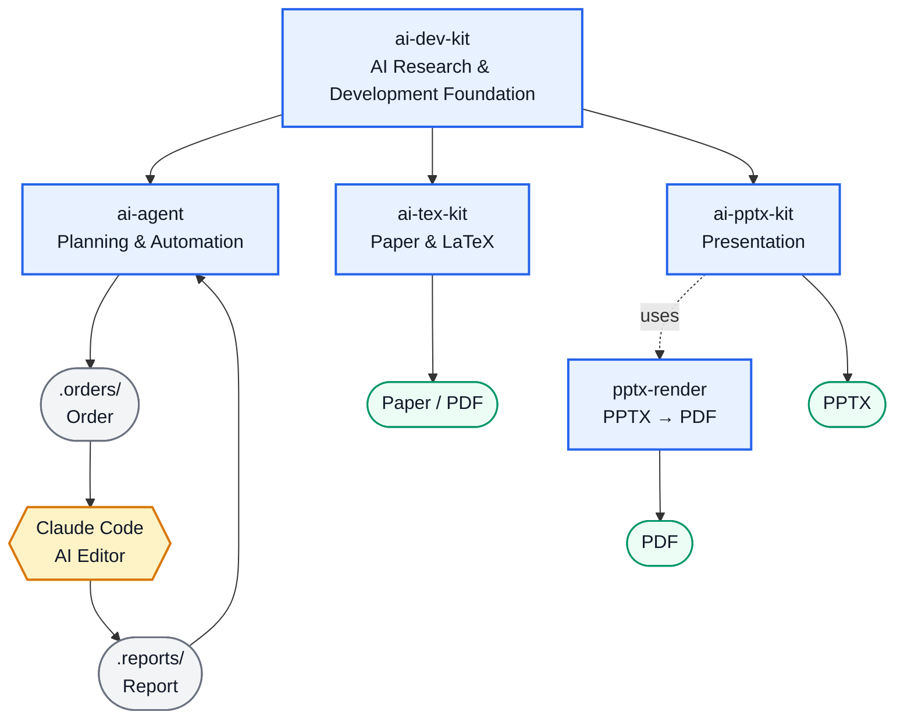
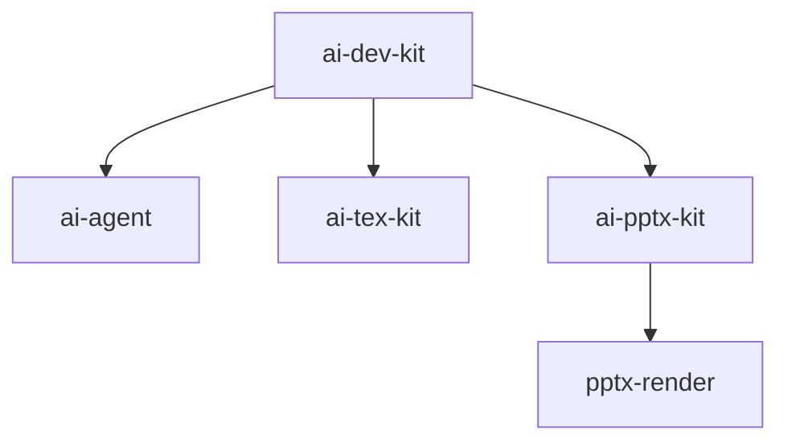

# ai-dev-kit
`ai-dev-kit` は，AIと人間が協調して研究・開発を行うための共通基盤です．
AIエージェントによる作業計画，プログラム開発，実験，論文作成，発表資料作成までを，一貫したワークフローとして管理します．
WSL上の共通開発環境と，AIコーディングに必要な指示・規約・便利ツールを提供します．



## WSL環境をインポート
0. WindowsのPCにVS Codeをインストール

1. 下記のリンクから `Ubuntu2204_AI_Dev.tar` をダウンロード
https://drive.google.com/drive/folders/1V0gRYpVfX93hNxGMjQ9Db66az0_YeI2z?usp=drive_link

2. 管理者として*コマンドプロンプト*を実行し，下記のコマンドを実行
```bash
wsl --update
(echo [wsl2] 
echo defaultVhdSize=1000GB
echo networkingMode=mirrored
echo [experimental]
echo sparseVhd=true
echo autoMemoryReclaim=gradual) > "%USERPROFILE%\.wslconfig"

mkdir C:\Ubuntu2204_AI_Dev
wsl --import Ubuntu2204_AI_Dev C:\Ubuntu2204_AI_Dev C:\Ubuntu2204_AI_Dev.tar
code --remote wsl+Ubuntu2204_AI_Dev /home/user/workspace
```

2回目以降は，下記のリンクから `lunch_Ubuntu2204_AI_Dev.bat` をダウンロードし，ダブルクリックするとVS Codeが実行される

https://drive.google.com/drive/folders/1V0gRYpVfX93hNxGMjQ9Db66az0_YeI2z?usp=drive_link
   
## プロジェクトを作る際
1. `Ubuntu2204_AI_Dev` のWSL環境に接続
2. `/home/user/workspace` の直下に作業ディレクトリを作成
3. 作業ディレクトリに移動し，VS Codeのターミナルで下記のコマンドを実行

```text
git init
echo "tokens.json" >> .gitignore

mkdir .ai
git submodule add https://github.com/yryo1005/ai-dev-kit.git .ai/ai-dev-kit
git submodule add https://github.com/yryo1005/ai-tex-kit.git .ai/ai-tex-kit
git submodule add https://github.com/yryo1005/ai-pptx-kit.git .ai/ai-pptx-kit
git submodule add https://github.com/yryo1005/ai-agent.git .ai/ai-agent
git submodule add https://github.com/yryo1005/pptx-render.git .ai/pptx-render
export PATH="$PATH:$(pwd)/.ai/ai-agent/bin"

cp .ai/ai-dev-kit/CLAUDE.md ./CLAUDE.md
cp .ai/ai-dev-kit/AGENTS.md ./AGENTS.md

mkdir .logs
mkdir .orders
mkdir .reports

echo "" >> .orders/order_001.md

# 山富以外は下記のプロセスは不要
wget https://github.com/yryo1005/ai-dev-kit/releases/download/v1.0.0/tokens.json.enc
openssl enc -d -aes-256-cbc -pbkdf2 -iter 100000 \
    -in tokens.json.enc \
    -out tokens.json 
```

### サブモジュールの構成


4. `.orders/order_{n:03}.md` を作成し，下記の内容を記述
```text
{作成するプログラムの指示}
```
※ `CLAUDE.md`，`AGENTS.md`を介して`ai-dev-kit/root_prompt.md`を参照するので，いずれのファイルの参照も不要です．

例)
```text
MNISTを分類するプログラムを作成してください
* AdamとSGDの学習結果を比較する
* Seed値は3種類試す
* Epoch数を5回にする
```

5. `.orders/order_{n:03}.md` を参照しプログラムを作成する様に指示する

## 基本原則
AIエージェントは，原則として以下のルールに従って作業します．
| ディレクトリ      | 役割         | 主な作成者 |
| ----------- | ---------- | ----- |
| `.orders/`  | AIへの作業依頼   | 人間    |
| `programs/` | 作成されたプログラム | AI    |
| `outputs/`  | プログラムの実行結果 | AI    |
| `.logs/`    | 作業ログ       | AI    |
| `.reports/` | 作業報告       | AI    |

## AI開発ワークフロー

このプロジェクトでは，AIエージェントによる開発作業を以下のディレクトリ構成で管理します．

```text
.orders/
    ↓
AIへの依頼

programs/
    ↓
AIが作成したプログラム

outputs/
    ↓
プログラムの実行結果

.logs/
    ↓
AIの作業ログ

.reports/
    ↓
AIによる作業報告
```

## Orderファイルの自動生成
AIエディタは，ユーザーから作業内容をチャットで指示された場合，その指示内容を `.orders/order_{n:03}.md` に保存します．
`n` は `.orders/` 内に存在する最大のOrder番号に1を加えた番号です．
この際，ユーザーの指示をどのように解釈，保管したかも `.orders/order_{n:03}.md` に記述されます

### WSL環境を作るためのコマンド
```bash
wsl --update
(echo [wsl2] 
echo defaultVhdSize=1000GB
echo networkingMode=mirrored
echo [experimental]
echo sparseVhd=true
echo autoMemoryReclaim=gradual) > "%USERPROFILE%\.wslconfig"

wsl --install -d Ubuntu-22.04

### 以下の内容を書き込み
username: user
passward: 20210401
###

sudo rm /etc/resolv.conf
sudo rm /etc/wsl.conf
mkdir /home/user/workspace

sudo nano /etc/wsl.conf
### 以下の内容を書き込み
[boot]
systemd=true
[network]
generateResolvConf=false
[interop]
enabled = true
appendWindowsPath = true
[automount]
enabled = true
mountFsTab = true
[user]
default = user
###

sudo nano /etc/resolv.conf
### 以下の内容を書き込み
nameserver 8.8.8.8
nameserver 8.8.4.4
###

echo 'cd /home/user/workspace' >> ~/.bashrc

wsl --shutdown

###
wsl --export Ubuntu-22.04 C:\Ubuntu-22.04.tar
mkdir C:\Ubuntu2204_AI_Dev
wsl --import Ubuntu2204_AI_Dev C:\Ubuntu2204_AI_Dev C:\Ubuntu-22.04.tar
wsl --manage Ubuntu2204_AI_Dev --resize 1000GB
wsl -d Ubuntu2204_AI_Dev

###
cd /home/user/
sudo apt update
sudo apt upgrade -y

# CUDA，CuDNN
wget https://developer.download.nvidia.com/compute/cuda/repos/wsl-ubuntu/x86_64/cuda-wsl-ubuntu.pin
sudo mv cuda-wsl-ubuntu.pin /etc/apt/preferences.d/cuda-repository-pin-600
wget https://developer.download.nvidia.com/compute/cuda/13.0.0/local_installers/cuda-repo-wsl-ubuntu-13-0-local_13.0.0-1_amd64.deb
sudo dpkg -i cuda-repo-wsl-ubuntu-13-0-local_13.0.0-1_amd64.deb
sudo cp /var/cuda-repo-wsl-ubuntu-13-0-local/cuda-*-keyring.gpg /usr/share/keyrings/
sudo apt-get update
sudo apt-get -y install cuda-toolkit-13-0
echo 'export PATH=/usr/local/cuda/bin:$PATH' >> ~/.bashrc
echo 'export LD_LIBRARY_PATH=/usr/local/cuda/lib64:$LD_LIBRARY_PATH' >> ~/.bashrc
echo 'export CUDA_HOME=/usr/local/cuda' >> ~/.bashrc
source ~/.bashrc
nvcc --version

wget https://developer.download.nvidia.com/compute/cudnn/9.23.2/local_installers/cudnn-local-repo-ubuntu2204-9.23.2_1.0-1_amd64.deb
sudo dpkg -i cudnn-local-repo-ubuntu2204-9.23.2_1.0-1_amd64.deb
sudo cp /var/cudnn-local-repo-ubuntu2204-9.23.2/cudnn-*-keyring.gpg /usr/share/keyrings/
sudo apt-get update
sudo apt-get -y install cudnn-cuda-13
CUDNN_SO=$(basename $(ls /usr/lib/x86_64-linux-gnu/libcudnn.so.9.*.* | head -n 1))
sudo ln -sf /usr/lib/x86_64-linux-gnu/${CUDNN_SO} /usr/local/cuda/lib64/libcudnn.so
sudo ln -sf /usr/lib/x86_64-linux-gnu/${CUDNN_SO} /usr/local/cuda/lib64/libcudnn.so.9
sudo ldconfig
sudo dpkg -l | grep cudnn

# APTパッケージ
sudo apt install -y \
    build-essential \
    pkg-config \
    curl \
    wget \
    unzip \
    zip \
    ca-certificates \
    python3-dev \
    git \
    git-lfs \
    libgl1-mesa-glx \
    libglib2.0-0 \
    htop \
    tmux \
    tree \
    ripgrep \
    fd-find \
    fzf \
    jq \
    ncdu \
    libreoffice \
    libreoffice-l10n-ja \
    libreoffice-help-ja \
    ffmpeg \
    gnupg

curl -fsSL https://get.docker.com | sudo sh
sudo usermod -aG docker $USER
sudo systemctl enable docker
sudo systemctl start docker

curl -fsSL https://deb.nodesource.com/setup_22.x | sudo -E bash -
sudo apt-get install -y nodejs

sudo add-apt-repository -y ppa:xtradeb/apps
sudo apt update
sudo apt install -y chromium

git lfs install
git config --global init.defaultBranch main
git config --global core.autocrlf input
git config --global pull.rebase false

mkdir -p ~/.local/bin
ln -sf "$(which fdfind)" ~/.local/bin/fd
echo 'export PATH="$HOME/.local/bin:$PATH"' >> ~/.bashrc
source ~/.bashrc

# UV
curl -LsSf https://astral.sh/uv/install.sh | sh
source $HOME/.local/bin/env

# TeX (インストール中に止まった場合，Enterキーを連打する)
sudo apt install -y \
    texlive-full \
    texlive-lang-japanese \
    texlive-fonts-recommended \
    texlive-fonts-extra \
    texlive-latex-extra \
    texlive-xetex

sudo kanji-config-updmap-sys haranoaji

sudo apt-get install -y  \
    dvisvgm \
    fontconfig \
    fonts-ipafont \
    fonts-ipaexfont \
    poppler-utils

### 
code /home/user/workspace
# 以下の拡張機能をVS Codeに追加する
# Python
# Jupyter
# indent-rainbow
# LaTeX Workshop
# Markdown Preview Enhanced
# Markdown PDF
# Claude Code for VS Code


###
wsl --shutdown

# 
sudo apt update
sudo apt upgrade -y
sudo apt clean
sudo apt autoremove -y
sudo apt autoclean
sudo journalctl --vacuum-time=3d
sudo rm -rf ~/.cache/*
sudo rm -rf /var/cache/*
sudo rm -rf /tmp/*

###
wsl --shutdown
wsl --export Ubuntu2204_AI_Dev C:\Ubuntu2204_AI_Dev.tar
```